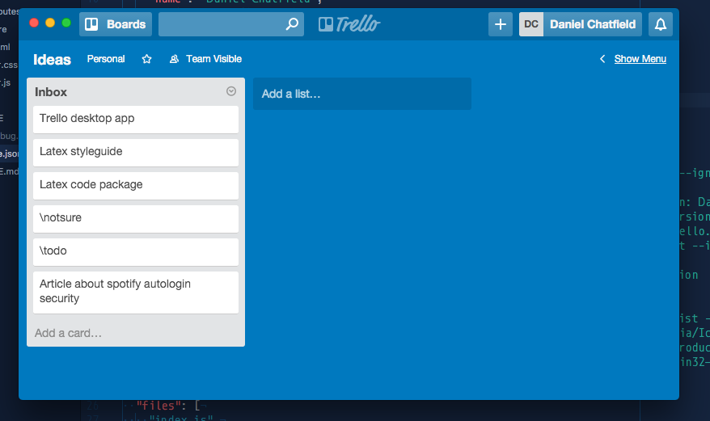

# &nbsp;Trello Desktop

> Unofficial Trello Desktop app

<br>
[](https://github.com/danielchatfield/trello-desktop/releases/latest)

*OS X 10.8+, Windows 7+ & Linux are supported.*

## Install

### OS X

[**Download**](https://github.com/danielchatfield/trello-desktop/releases/latest), unzip, and move `Trello.app` to the `/Applications` directory.

### Linux

[**Download**](https://github.com/danielchatfield/trello-desktop/releases/latest) and unzip to some location.

To add a shortcut to the app, create a file in `~/.local/share/applications` called `trello.desktop` with the following contents:

```
[Desktop Entry]
Name=Trello
Exec=/full/path/to/folder/Trello
Terminal=false
Type=Application
Icon=/full/path/to/folder/Trello/resources/app/media/Icon.png
```

### Windows

[**Download**](https://github.com/danielchatfield/trello-desktop/releases/latest) and unzip to some location.


## Dev

Built with [Electron](http://electron.atom.io).

###### Commands

- Init: `$ npm install`
- Run: `$ npm start`
- Build OS X: `$ npm run build-osx`
- Build Linux: `$ npm run build-linux`
- Build Windows: `$ npm run build-windows`
- Build all: `$ brew install wine` and `$ npm run build` *(OS X only)*

## License

MIT © [Daniel Chatfield](http://danielchatfield.com)
